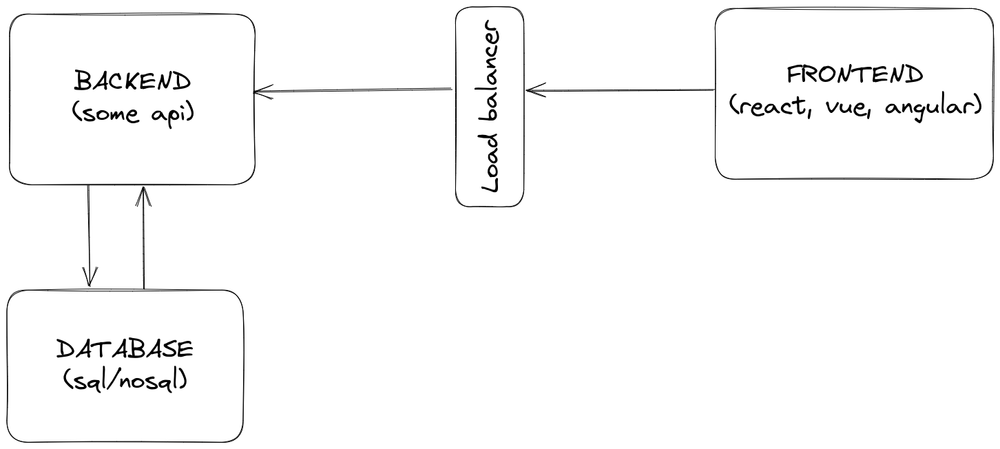

# Fullstack Question

Supongamos que vos estas encargado de todo el stack de una aplicacion. Esta aplicacion esta conformada por los siguientes components:

- Frontend
- Load Balancer
- Backend
- Database

En el transcurso de la aplicacion surge el siguiente problema:

Un usuario usa esta aplicacion. Cuando el usuario hace click sobre un boton que se encuentra renderizado en una de las paginas, la aplicacion queda frizada o no responde durante 60 segundos. Luego de esos 60 segundos, una tabla es renderizada con los resultados de la solicitud dentro de la aplicacion

La pregunta es la siguiente: ¿Que harias vos para identificar este problema de rendimiento en todo el stack?
